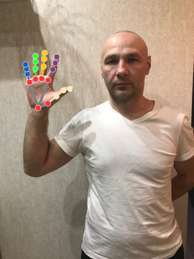
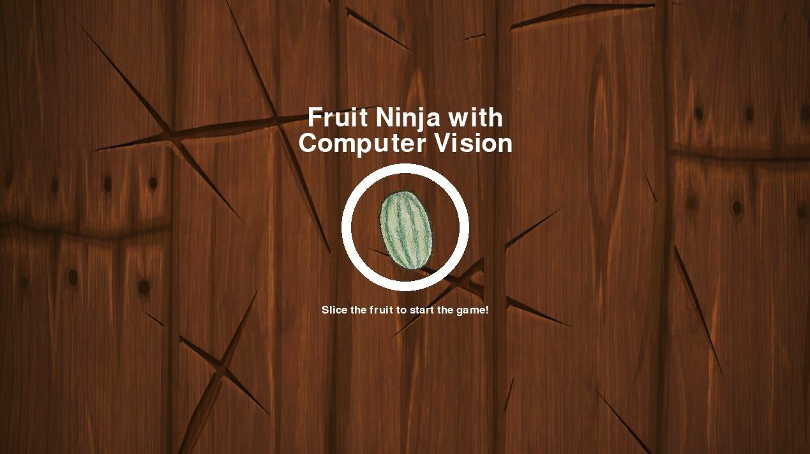
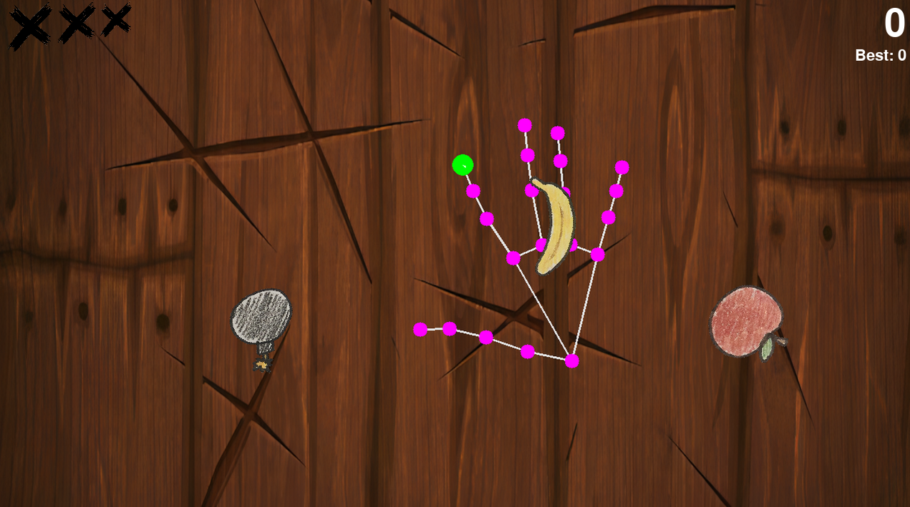

# 🥷 Fruit Ninja Track 🍉

Welcome to the **Fruit Ninja Track** — an exciting side challenge where you'll integrate computer vision capabilities into a fun and interactive game. The challenge tests your data manipulation abilities, basic machine learning knowledge, and Python coding skills. 

The track is divided into 4 different tasks:
* Hand Landmark Detection
* Hand Gesture Classification
* Hand Gesture Recognition
* Integrating your models into a Python-based Fruit Ninja-style game.
---

## 👀 What the Player Sees

### Assets:
- A `download_dataset` script.
- The Fruit Ninja game codebase.

### 0. Dataset Retrieval
Run `download_dataset` to download the neccesary dataset archives, by default under `datasets`. It should contain the following archives:
* The **landmark detection** dataset.
* A **gesture classification** dataset.
* The **gesture recognition** dataset.

### 1. Landmark Detection (Very Easy)
#### Task Description:
In this task, you need to extract hand keypoints from the images provided in the `landmark_detection_dataset` and draw them on the images. 

#### Requirements:
* While **we do NOT impose a specific method**, we recommend using [MediaPipe](https://mediapipe.readthedocs.io/en/latest/solutions/hands.html), which is an efficient and reliable tool for this purpose:

* The key requirement is to be able to extract the index finger keypoint, as it will be crucial for completing the last task.


#### What you should submit:
- An archive named according to the convention: `landmarks_{team_name}.zip`, containing the images with the drawn landmarks. For example:



### 2. Hand Gesture Classification (Easy)
#### Task Description:
In this task, you should use the `gesture_classification` dataset to train and classify gestures in images that contain only a single gesture. These images will be static, and your goal is to accurately classify the gesture shown in each image.

#### Requirements:
* You are free to use any classification method of your choice.
* Shuffle the test dataset using the manual seed `42` when performing submission.
* When submitting your results, include the exact class name as found in the annotations (e.g., "rock", "peace", "fist", etc.).
* If no gesture is detected in a test image, assign the "no_gesture" class.

#### What you should submit:
- A `.txt` file where each row contains the literal class of the image, in the order specified in the requirements.

### 3. Hand Gesture Recognition
In this task, you are required to detect and classify hand gestures in more complex images that may contain multiple hands, each performing a different gesture. You need to identify the bounding boxes for each hand and classify the gesture associated with each hand.

#### 3.1 Getting familiar with bounding box annotations (Easy)

The first subtask is to get familiar with the dataset. Read one image that contains each gesture in the dataset and plot the bounding box around it + class using the annotations file.

**TODO:** add sample image.

#### Requirements:
* Submit at least one image for each gesture, even if multiple gestures appear in the same image. Only plot a bounding box for the representative gesture.

#### 3.2 Gesture Recognition (Medium to Advanced)
In this task, you will perform the actual detection of hand gestures by locating the bounding boxes and assigning the correct class to each detected gesture.

#### Requirements:
* Feel free to use the method of your choice.

#### What you should submit:
* An archive named according to the convention: "bboxes_{team_name}.zip", containing the annotated images required at #3.1.
* The annotation file in YOLO format for each image within the test folder, with bounding boxes and class labels.

### 4. Fruit Ninja Gameplay (Medium)
Now, you will be able to integrate your methods into a computer vision game and make it fully functional.

#### Game Overview
You are provided with the python codebase of the game, under the `fj_game` directory. A quickstart to get the game running:

1. Install all the dependencies listed in `requirements.txt`.
2. To start the game, navigate to the game directory and run:
    ```python
    python main.py
    ```
3. The intro screen will appear, but the game won’t progress until you slice the watermelon 🍉 in the center using your index finger.



4. The game operates in a loop, where the `main` module repeatedly queries the `HandDetector` instance for the coordinates of the index finger’s tip and the current background image:
```python
    # Read a new webcam frame and process it
    frame, index_finger_coords = hand_detector.process()
```

5. The only module you have to edit is the `hand_detector` where you should implement the `HandDetector` class:
```python
class HandDetector:
    def __init__(self, screen_width, screen_height):
        # Store the screen dimensions as instance variables.
        # These might be useful later for coordinate normalization or scaling.
        self.screen_width = screen_width
        self.screen_height = screen_height

    def process(self, bg_img=None):
        """
        This method should return:
        1. The current frame (with any visualizations or overlays, if needed).
        2. The coordinates of the index finger's tip as a tuple: (x, y).
        
        Notes for participants:
        - You only need to return the index finger position for ONE hand,
          even if multiple hands are detected in the frame.
        - If no hand or landmarks are detected, return an empty tuple for the coordinates.
        """

        # Background frame to be used for rendering by default (passed into the function).
        img = bg_img

        # Default values for the index finger coordinates.
        # These should be replaced with the real coordinates if a hand is detected.
        index_finger_x = None
        index_finger_y = None

        # === TODO ===
        # Add your hand detection and landmark extraction logic here.
        # You may use libraries such as MediaPipe to detect hand landmarks.
        # Extract the index finger tip coordinates (landmark 8 in MediaPipe).
        # Assign the x, y values to index_finger_x and index_finger_y.

        # Return the frame and the index finger coordinates as a tuple.
        return img, (index_finger_x, index_finger_y)
```

#### 4.1 Slice fruits just using your index finger
Implement the logic that 
1. Retrieves input from your personal webcam and processes the frames
2. Returns through the process function the background image and the tuple containing the coordinates of the index finger's tip (**absolute coordinates on the screen** - they are passed inside the constructor). 
3. It is advised to draw all the extracted landmarks on the background image. 

Here is an example of the game once you start playing:



**Notes:** 
* The `main` module already displays a green dot on your finger tip. You'll need to draw the other landmarks yourself. **This graphic style is NOT mandatory, get creative instead**.
* You may use the image retrieved from the camera directly instead of the background image, to help you slice the fruits better 🥷. 

#### What you should submit:
* A short video of you playing Fruit Ninja.
* The `hand_detector` module including a comment section with a brief explanation of how you implemented the logic.

#### 4.1 Implement Hand Gesture Classification
Avoiding bombs 💣 is difficult... Implement gesture classification/detection, to only return the finger's coordinates when the "Two fingers up" gesture is performed. 

#### What you should submit:
* A short video of you playing Fruit Ninja, in which you showcase the gesture classification functionality.
* The updated `hand_detector` module including a comment section with a brief explanation of how you implemented the logic.


### 📝 General Notes and Pieces of Advice:
* You can use the same method for tasks #2 and #3 (e.g., a detection algorithm for classifying the images in task 2). However, keep in mind that task #4 demands fast processing speed.

* Feel free to use the provided classification dataset for gesture recognition if needed. The classification dataset also includes annotations.

* While all tasks are interconnected, you can still earn partial points even if you don’t complete previous tasks with maximum points or at all. So, don’t get discouraged if something doesn’t work as expected. Carefully read the requirements and find alternative solutions to overcome challenges.

* The pretrained YOLOv8 model provided for the flag search track can be utilized in other tracks as well.

---

## 🧠 What the Jury Needs to Know

- TBD

---

### 🧮 Final Score

- TBD

---

### ✅ Jury Instructions (How to Run Evaluation)

- TBD

---

## 🧪 What Was Done in the Backend

-  TBD

---

Estimated time to complete: 3-5 hours.
