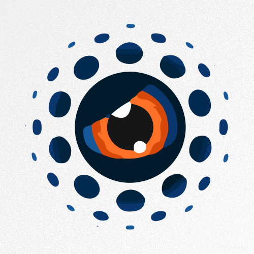
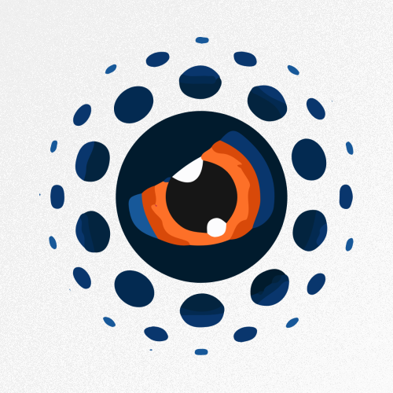
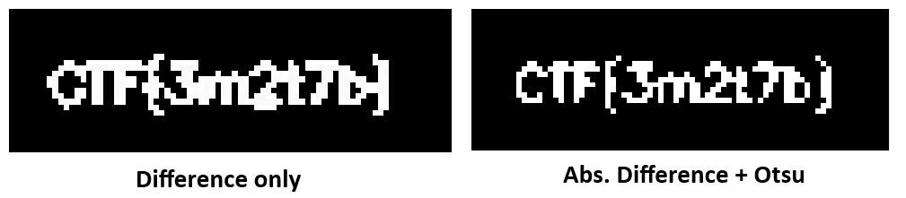
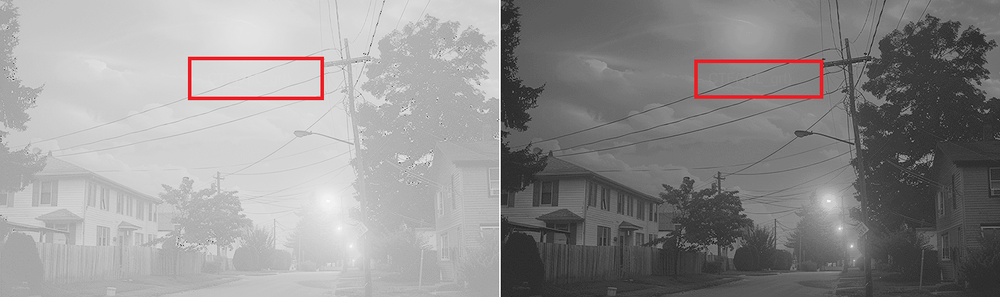
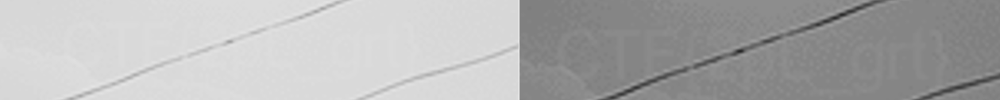
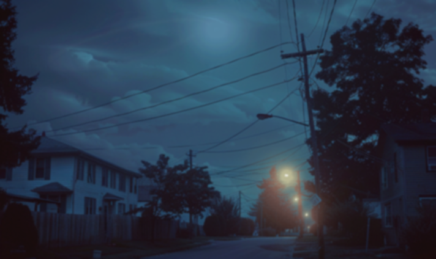
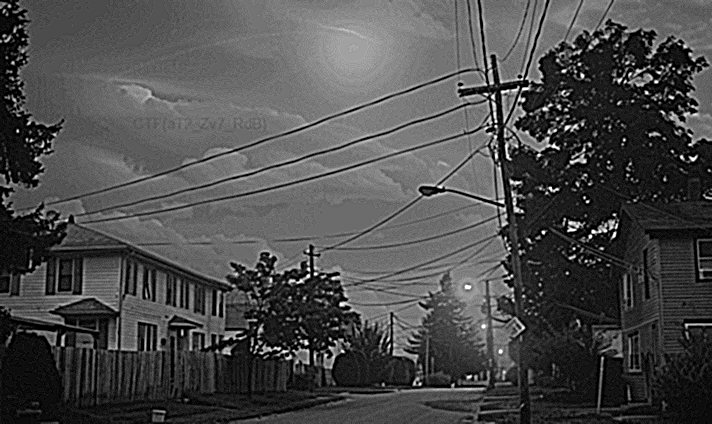

# 🎯 Image Steganography Side Challenge

Here is the **Image Lab SC** — a fun side challenge to showcase your abilities in fundamental image processing and enhancement techniques!
---

## 👀 What the Player Sees

You receive:
- A set of images containing hidden flags.

Your submission should include:
- The hidden flags for each task.

---

## 🧠 What the Jury Needs to Know

### 🧼 SC 2.1 — Image Subtraction and Binarization (Very Easy)

The contestants are provided with two seemingly identical images and must subtract them to reveal the hidden message.

Simple subtraction may be sufficient for some to uncover the flag, but using `absdiff` and Otsu thresholding might render better results.

---

### 🧼 SC 2.2 — Image Contrast Enhancement (Easy)

An image containing the hidden flag is overexposed. Contestants need to recognize that an inverse operation is required. Several contrast enhancement techniques can be used, including linear and nonlinear transformations, histogram equalization (HEQ), or CLAHE.

---

### 🧼 SC 2.3 — In-channel Hidden Message (Medium)

A flag is embedded in the blue channel of an image but appears blurred. Contestants must identify the correct color channel and apply a derivative filter to enhance the sharpness.

---

### 🧮 Final Score

Each flag may be assigned points according to its specified difficulty level and estimated completion time.

---

Estimated time to complete: 
* SC 2.1 - 15min.
* SC 2.2 - 25min.
* SC 2.3 - 30min.

**Total: 1h10min**

